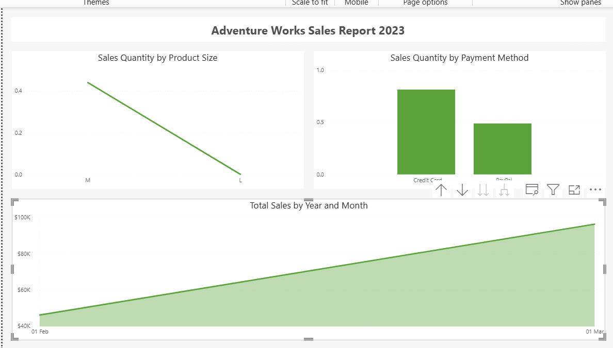

# 📊 Power BI Performance Optimization – Adventure Works Sales Report

## 📌 Project Overview

This project focuses on analyzing and improving the performance of a Power BI dashboard built using the Adventure Works dataset. The goal was to identify performance bottlenecks and apply targeted optimizations to enhance report responsiveness.

---

## 🚨 Problem Statement

Several visuals in the report showed high load times (~250–280 ms), resulting in slow interaction and poor user experience.

---

## 🔍 Analysis Approach

Using Power BI's **Performance Analyzer**, each visual was examined to break down execution time into:

* DAX Query
* Visual Display
* Other processing time

### Key Observation:

* DAX query time was minimal across visuals
* Majority of delay was caused by **visual complexity and rendering overhead**

---

## 🛠️ Solution Implemented

* Simplified date hierarchy from:

  * Year → Quarter → Month → Day
    to
  * Year → Month
* Reduced the number of data points processed in visuals
* Improved rendering efficiency by simplifying visual structure

---

## 📈 Results

* Reduced load time across all visuals
* Improved overall dashboard responsiveness
* Eliminated unnecessary DAX optimization

---

## 🧠 Key Learnings

* Not all performance issues are related to DAX
* Performance Analyzer is essential for identifying root causes
* Visual design and data volume significantly impact performance

---

## 🧰 Tools & Technologies

* Microsoft Power BI Desktop
* DAX (Data Analysis Expressions)
* Performance Analyzer

---

## 📸 Screenshots 
# Performance Analyzer - Before Optimization

---

# Performance Analyzer - After Optimization

---

## 🎯 Skills Demonstrated

* Power BI Performance Optimization
* Analytical Thinking
* Root Cause Analysis
* Data Validation
* Dashboard Design Improvement

---

## 💡 Conclusion

This project demonstrates a practical approach to performance tuning in Power BI by focusing on the actual bottleneck rather than assuming DAX inefficiency. It highlights the importance of data-driven decision-making in optimizing reports.

---
